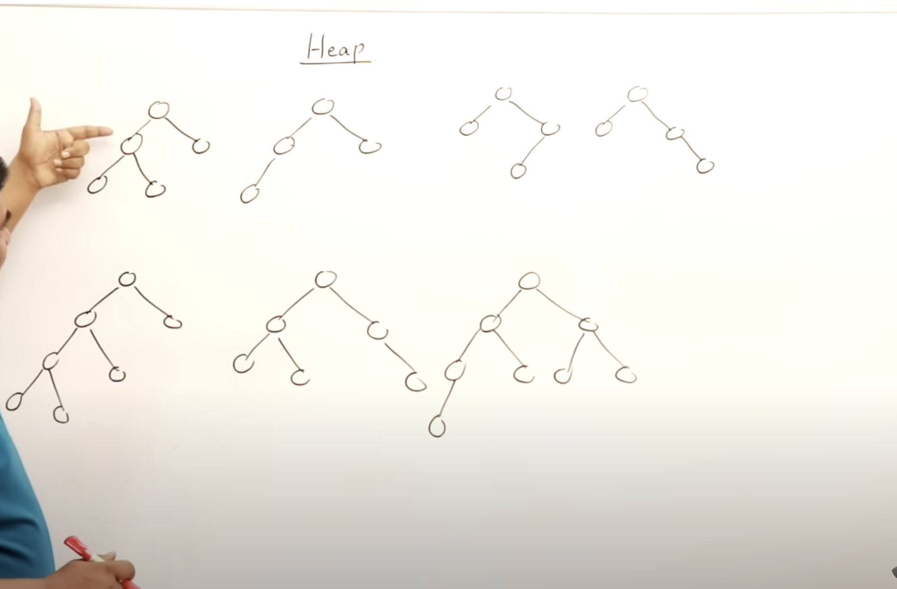
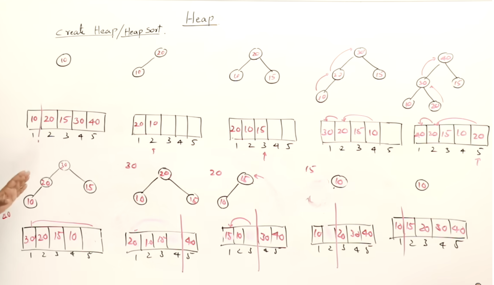

# Array representation of binary tree:

1.            A                                 // 1:A 2:B 3:C 4:D 5:E 6:F 7:G                          
        B           C   
    D       E   F       G

2.             A                                // A B C D E                   
        B           C       
    D       E

3.             A                               // A B C - - D E
        B           C
                D       E

if a node is at index i
its left child is at => 2 * i
its right child is at => 2 * i + 1
its parent is at  => floor(i / 2)

For eg: in 1st diagram: 

left of C => 2 * 3 => 6 => F
right of C => 2 * 3 + 1 => 6 + 1 => G
parent of C => 3 / 2 => 1 => A

# Full and complete binary tree:

* Any full binary tree is also a complete binary tree
* The height of complete binary tree is log n

-> Full binary tree is a tree where all level of tree is filled. so if 3 level of tree and filled nodes are 15 then its full binary tree as there is no space left.

2 ^ h - 1 

eg: h = 3

2 ^ 4 - 1 => 15

-> All levels, except possibly the last, are filled, and the nodes are as left as possible.
-> When you represent a tree as array and there is no blank space that is a complete binary tree
-> If any space that is no complete binary tree:

for eg: above diagram 1 and 2 is complete binary tree but 3 is not 

 some more example in this diagram.

# Heap:

* Heap is a complete binary tree.
* duplicates are allowed in heap.

Two type of heap:

1. max heap
* Parent value is always maximum or equal of its decendents
* Root will always have largest value

            50
    30              20
15      10      8       16

2. min heap
* Parent value is always minimum of its decendents
* Root will always have smallest value

            10
    30              20
35      40      32       25

# Insert and Delete in Max Heap:

* Insert operation:
- add the new element at the end of the free space of tree 
- Create the complete tree
    - compare with parent 
    - is new element greather than above swap unitl reach parent
- n element inseartion take time of hight of tree => n log n
- Inserting a single element in heap min is O(1) and max is O(log n)
- While inserting direction is from leaf to root always upwards

* Delete operation:
- In heap we can delete any other element than root. Consider this as parmind of apples. we can remove apple from top only.
- We should be preserving complete binary tree
- take last node of tree and replace with root
- adjest the tree to have max heap
    - root compared with decendetns any one maximum swap until end of tree
- In deletion direction is from root to leaf always downwards
- O(log n) max time in deletion

# Heap sort:

- When deleting from max heap we always gets the maximum value.
- So deletion from max heap gives us the sorted array

- Steps to do the head sort:
    - Create heap from given elements => O(n log n)
    - Delete from created heap one by one will give us sorted elements O(n log n)

Complexity O(n log n)

# Heapify
- Heapify is a way to create a heap one by one from downward ways 

Setps:
- Go to end of the tree and the last element and check if there is any element
- check h - 1 level and check if value of child is greater then swap

- O(n) which is good from O(n log n) so using heapify we can imporve the creation of max or min heap

# Priority queue:

- Queue is mainly FIFO but priority queue is not stricly FIFO is based on priority of element
- element will have priority delete and creation dependes on priority
- Smallest number higher priority => Create min heap
- Large number higher priority => Create max heap
- If we create priority queue using normal array then time compleixty will be O(n)
- Heap is best way to implement priority queue O(log n) for both insert or delete operation