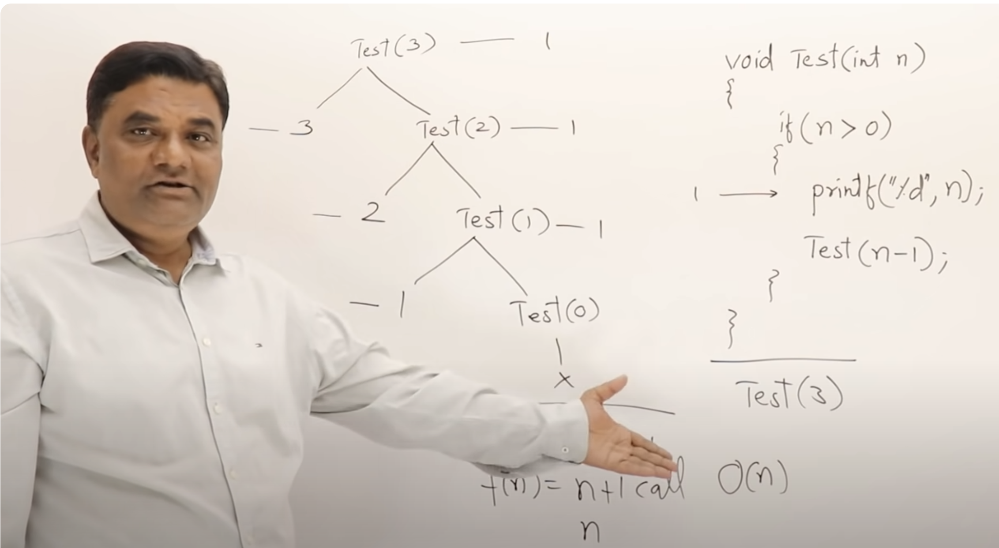

## Recursion

- When we write a function in a simpler form of itself we call such function a recursion.
- With recursion the end condition or base case is so critical, if not providing correctly can lead to memory overflow

### Factorial
```
n! => n * (n - 1)!

if n > 0 => n * (n - 1)!
if n == 0 => 1

            return                state
f(4)        4 * f(3) = 24         Pause
f(3)        3 * f(2) = 6          Pause
f(2)        2 * f(1) = 2          Pause
f(1)        1 * f(0) = 1          Pause
f(0)        1
```

## Why recursion is not always good:
### Fibonacci

```
Fib(n) => fib(n - 1) + fib(n - 2)   if n > 1
       => n                         if n = 0,1

```

- Calculating fib using iterative is better then recursion
- When calculating using iterative method each state will be calculated exactly once
- But when calculation using recursion method F(n) will be called exponentially as input grows.
- So recursion some time could be easy to write but can be expensive in terms of time and space that it takes.

See image to understand the tracing tree/recursive tree of a function and understand the complexity.



