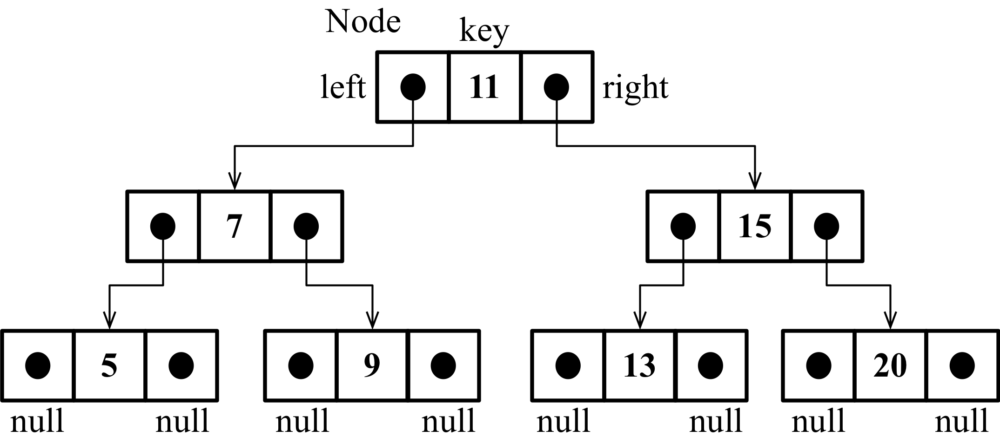

BST:

Lookup, Insert & delete: O(log n)

# To perform binary search list has to be in sorted order
# Iterative method:
    1. Get l and h
    2. Get Mid l + h / 2
    3. if search === mid => Result the search 
    4. if search > mid => move right
        i. l = mid + 1
    5. if search < mid => move left
        i. h = mid - 1
    6. if l > h => element not found




eg: 3,6,8,12,14,17,25,29,31,36,42,47,53,55,62
    0 1 2 3  4  5  6  7  8  9  10 11 12 13 14     

Tracing tree:

                                8

                4                               12

        2               6               10              14

    1       3       5       7       9       11      13      15

# Maximum comparision dependes on heigth of Tree: O(log n)


if n = 16

      16
=> log    => 4
      2


# Recursive method:
```
recursiveBST(l, h, key)
{
    // if problem is very small (assume single value) (exit condition)
    if l === h
    {
        if A[l] === key return l
        else return 0
    }

    else {
        mid = (l + h / 2)
        if key === A[mid] => return mid
        if(key < A[mid]) => recursiveBST(l, mid - 1, key)
        if(key > A[mid]) => recursiveBST(mid + 1, h, key)
    }
}

```