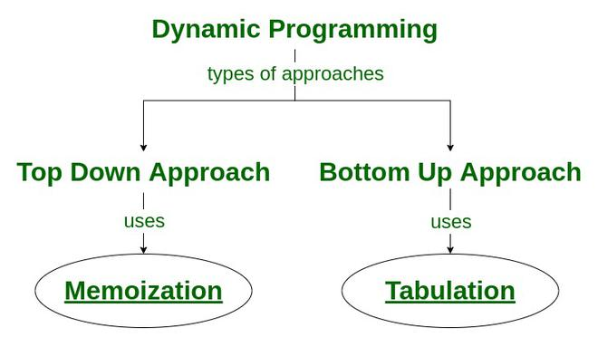
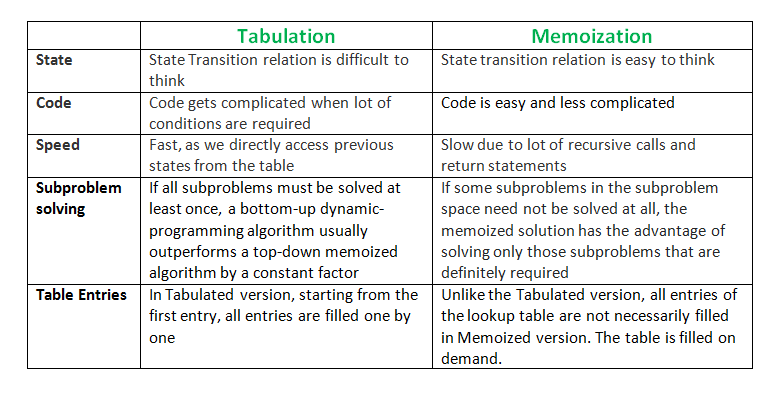

# Dynamic programming

- Dynamic programming is defined as a computer programming technique where an algorithmic problem is first broken down into sub-problems, the results are saved, and then the sub-problems are optimized to find the overall solution — which usually has to do with finding the maximum and minimum range of the algorithmic query.
- This technique solves problems by breaking them into smaller, overlapping subproblem. The results are then stored in a table to be reused so the same problem will not have to be computed again. 

## Recursion vs Dynamic programming

- Dynamic programming is an optimization technique for recursive solutions.
- However, not all problems that use recursion can be solved by dynamic programming. Unless solutions to the subproblem overlap, a recursion solution can only be arrived at using a divide-and-conquer method.
- For eg. like merge sort and quick sort are not considered dynamic programming problems. This is because they involve putting together the best answers to subproblem that don’t overlap.

## Top-Down vs Bottom-Up approach

- The top-down method solves equations by breaking them into smaller ones and reusing the answers when needed.
- The bottom-up approach solves equations by breaking them up into smaller ones, then tries to solve the equation with the smallest mathematical value, and then works its way up to the equation with the biggest value.

    - Top-Down Approach: This approach follows the memoization technique. It consists of recursion and caching. In computation, recursion represents the process of calling functions repeatedly, whereas cache refers to the process of storing intermediate results.

    - Bottom-Up Approach: This approach uses the tabulation technique to implement the dynamic programming solution. It addresses the same problems as before, but without recursion. In this approach, iteration replaces recursion. Hence, there is no stack overflow error or overhead of recursive procedures.

## Memorization: https://www.geeksforgeeks.org/what-is-memoization-a-complete-tutorial/

- In computing, memoization is used to speed up computer programs by eliminating the repetitive computation of results, and by avoiding repeated calls to functions that process the same input.
- Memoization is a specific form of caching that is used in dynamic programming. The purpose of caching is to improve the performance of our programs and keep data accessible that can be used later. It basically stores the previously calculated result of the subproblem and uses the stored result for the same subproblem. 
-  This kind of problem is mostly used in the context of recursion, especially with problems that involve overlapping subproblems.

Type of Memorization:
- 1D: The recursive function that has only one argument whose value was not constant after every function call.
- 2D: The recursive function that has only two arguments whose value was not constant after every function call.
- 3D: The recursive function that has only three arguments whose values were not constant after every function call.

## Tabulation
How Memoization is different from Tabulation?

## Following are the two main properties of a problem that suggests that the given problem can be solved using Dynamic programming.
- Overlapping Subproblems  [Fibonacci]
- Optimal Substructure [SingleSortestPath]: A given problem is said to have Optimal Substructure Property if the optimal solution of the given problem can be obtained by using the optimal solution to its subproblems instead of trying every possible way to solve the subproblems. 

## Dynamic Programming Algorithms:
- Greedy algorithms
- Floyd-Warshall algorithm
- Bellman Ford algorithm

## DP examples:
1. Identifying the number of ways to cover a distance
2. Identifying the optimal strategy of a game
3. Counting the number of possible outcomes of a particular die roll 
